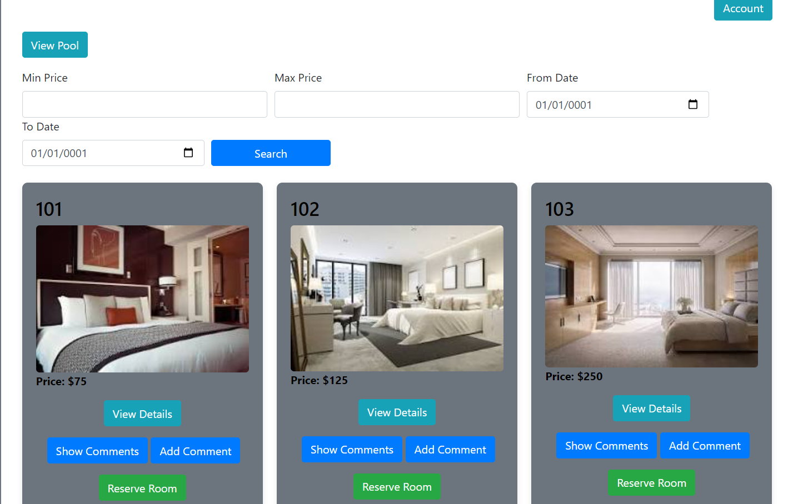
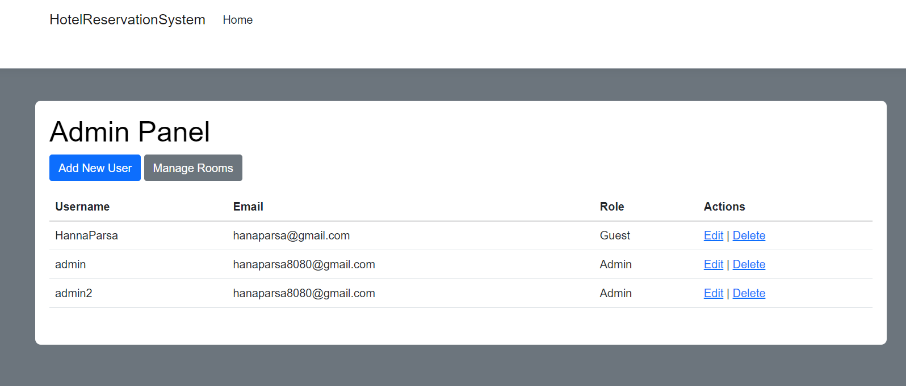
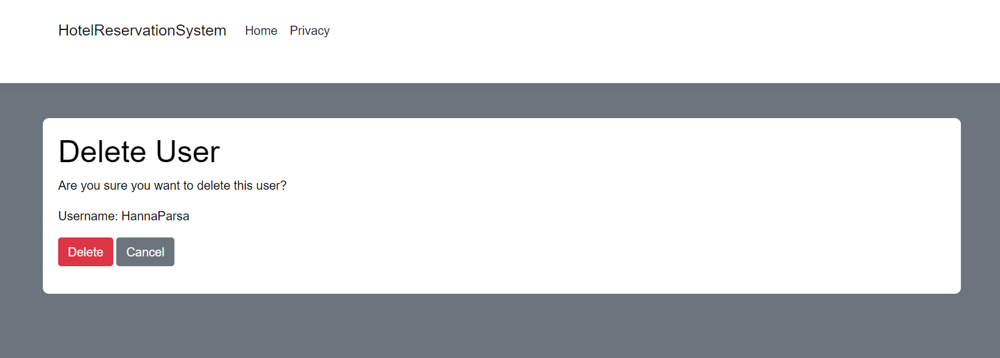
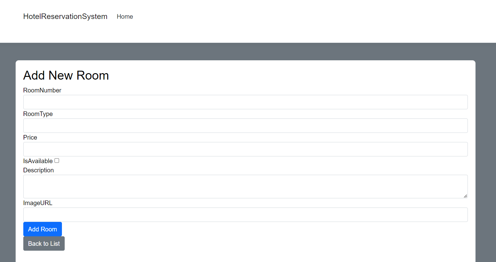
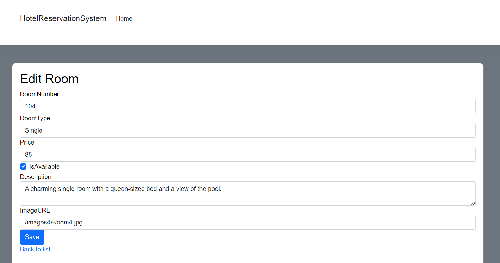

### This ASP.NET Razor Pages project is a comprehensive hotel reservation system that allows users to:
- **Register & Log In**: Create an account and log in to manage reservations.
- **Search & Reserve Rooms**: Find available rooms based on search criteria and make reservations.
- **Rate & Comment**: Leave feedback and rate rooms after staying.
- **Manage Reservations**: View, edit, or cancel your reservations.
### Admin Panel
- **User Management**: Admins can add, delete, and edit user accounts.
- **Role Management**: Admins can change user roles, including promoting users to admin.
- **Romm Managment**: Admins can delete, add or edit rooms.
## Features
- **User Authentication**: Secure login and registration system.
- **Room Search**: Flexible search options for finding rooms.
- **Reservation Management**: Easy booking and modification of reservations.
- **Feedback System**: Comment and rate rooms to share your experience.
- **Admin Controls**: Comprehensive tools for managing users, roles and rooms.
## Getting Started
1. **Clone the Repository**: `git clone <repository-url>`
2. **Install Dependencies**: Ensure you have the necessary packages installed and the ssms.
3. **Run the Project**: Start the application using Visual Studio or your preferred IDE.
## Technologies Used
- ASP.NET Core
- Razor Pages
- Entity Framework Core
- SQL Server
### Guest panel

### Admin panel

